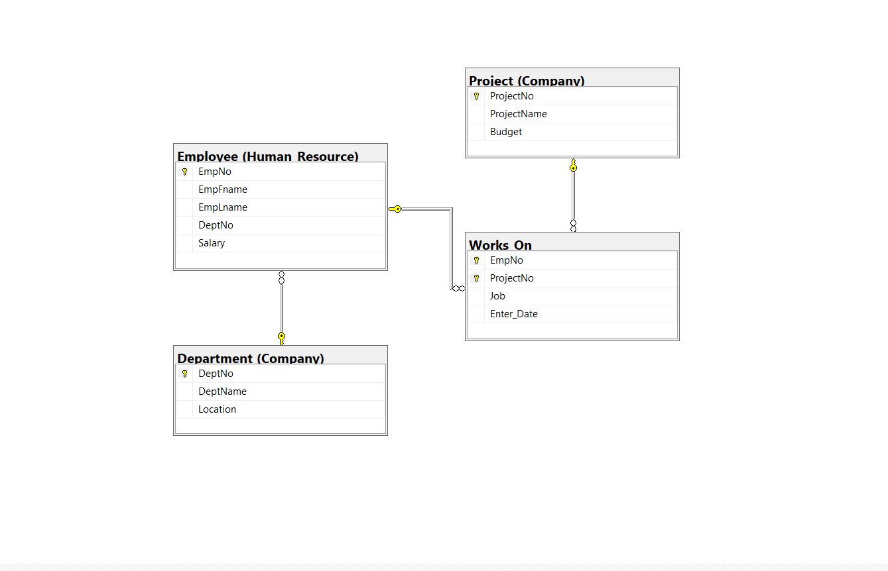

# 🏛️ Day 01 - Database Administration & Advanced Governance

### 🎯 Objectives
* Implement **Physical Storage Strategy** using FileGroups and multiple Data Files.
* Master **Domain Integrity** through User-Defined Data Types (UDDTs), Rules, and Defaults.
* Organize database objects using **Schemas** for better security and logical grouping.
* Understand **Referential Integrity** behavior during PK updates and deletions.
* Utilize **Synonyms** to simplify object referencing across schemas.
* Manage **Security & Permissions** by creating Logins with specific CRUD restrictions.

---

### 📊 Logic & Infrastructure Breakdown

| Feature | Implementation | Benefit |
| :--- | :--- | :--- |
| **File Groups** | `SecondaryFG`, `ThirdFG` | Improved I/O performance by distributing data across files. |
| **UDDTs** | `sp_addtype loc, 'nchar(2)'` | Creating reusable, domain-specific data types. |
| **Rules/Defaults** | `CREATE RULE`, `CREATE DEFAULT` | Centralized data validation and default value management. |
| **Schemas** | `Company`, `Human_Resource` | Security isolation and logical namespace management. |

---

### 📝 Tasks Summary

#### 1. Advanced Physical & Logical Design
* **Storage:** Configured the database with two secondary FileGroups, each containing two data files, optimizing physical storage distribution.
* **Integrity:** Created a custom data type `loc` with a rule restricting it to ('NY','DS','KW') and a default value 'NY'.
* **Constraint Enforcement:** Bound rules and defaults to table columns to ensure strict data entry standards.

#### 2. Schema Management & Organization
* **Namespace Transfer:** Created `Company` and `Human_Resource` schemas to categorize tables.
* **Synonyms:** Established a synonym `Emp` for `Human_Resource.Employee` to streamline query writing and abstract the schema layer.

#### 3. Testing Referential Integrity
* **Safety Checks:** Demonstrated how Foreign Key constraints prevent "Orphaned Records" by blocking invalid inserts into `Works_on` and preventing the deletion of active employees.
* **Cascade Behavior:** Analyzed the impact of updating Primary Keys when they are referenced by other tables.

#### 4. Complex Data Manipulation (Cross-Schema)
* **Joined Updates:** Performed budget increases and department renames by joining tables across the `Company` and `Human_Resource` schemas.
* **Targeted Deletions:** Removed work records based on department location criteria using multi-table join logic.

#### 5. Database Security (Logins)
* **Access Control:** Created a dedicated login `ITIStud` with restricted access to specific tables (`Student`, `Course`).
* **Granular Permissions:** Configured permissions to allow `SELECT` and `INSERT` while explicitly denying `UPDATE` and `DELETE`.

---

### 🖼️ Database Diagram

*The diagram above illustrates the final physical relationship between the tables after schema transfers.*

---

### 💡 Technical Insights

* **Storage Optimization:** Using multiple FileGroups allows SQL Server to perform parallel reads/writes, significantly speeding up large operations.
* **The "Synonym" Advantage:** Synonyms allow developers to change the underlying table location or schema without breaking the application code that references the synonym.
* **Rules vs. Constraints:** While modern SQL uses `CHECK` constraints, learning `RULES` is essential for maintaining legacy systems and centralized validation logic.
* **Referential Integrity:** Task 5 proved that the database acts as the "Guardian" of data consistency, ensuring no record is left without a parent.